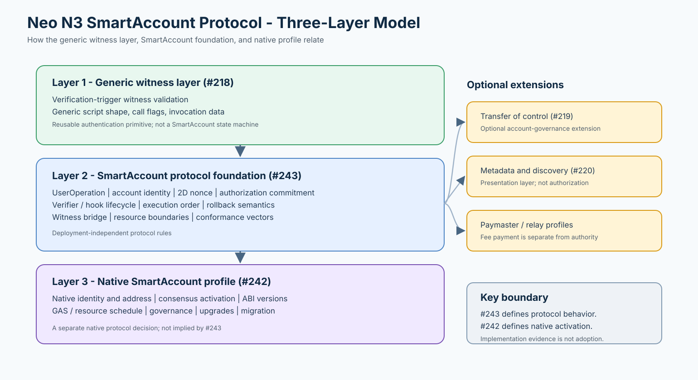
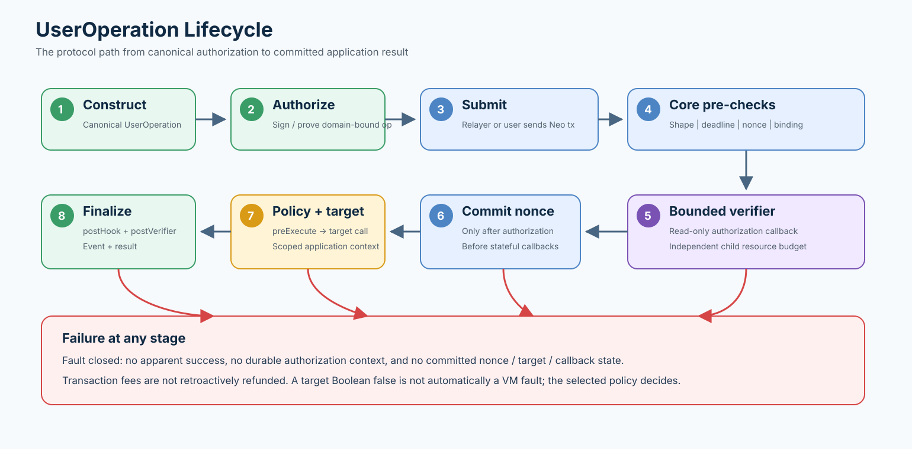
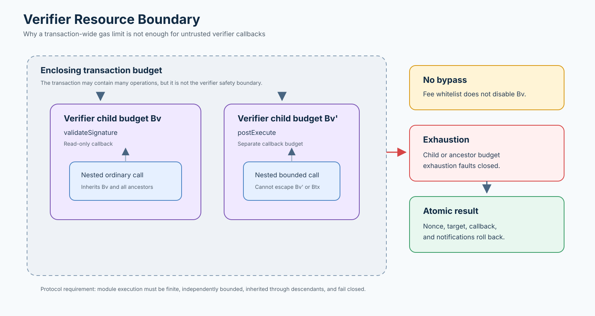
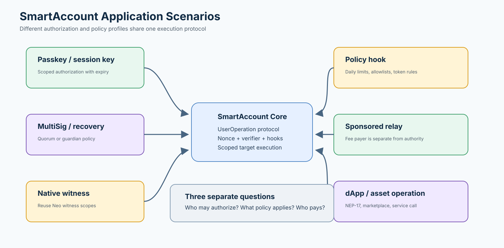
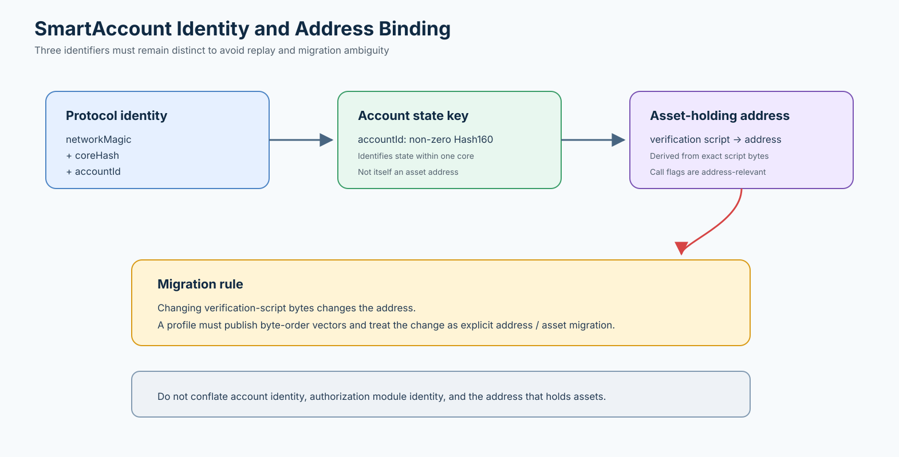

# SmartAccount Protocol Diagrams

These diagrams explain the protocol boundary in Draft PR #243 and the native profile boundary in Issue #242. They are intentionally implementation-independent.

## Protocol layers

The generic witness layer authenticates scripts; the SmartAccount foundation standardizes operations and lifecycle; a native SmartAccount profile adds consensus and governance rules.

## SmartAccount operation walkthrough

The approved walkthrough image is intentionally kept outside Git and is attached only to the discussion issue.

## UserOperation lifecycle

Authorization occurs before nonce consumption and stateful callbacks. Any failure is fail-closed and preserves application-state atomicity.

## Verifier resource boundary

A transaction-wide budget is not an independent bound for an untrusted verifier. Child budgets must be inherited by descendants and must fail closed.

## Application scenarios

Passkeys, session keys, MultiSig, recovery, native witnesses, policy hooks, and sponsored relays are profiles around the same execution protocol.

## Identity and address binding

`accountId`, the protocol identity, and the verification-script-derived asset address are distinct values. Changing script bytes is an address migration.

These diagrams are explanatory aids, not normative text. The MediaWiki proposal remains the authoritative protocol document.
